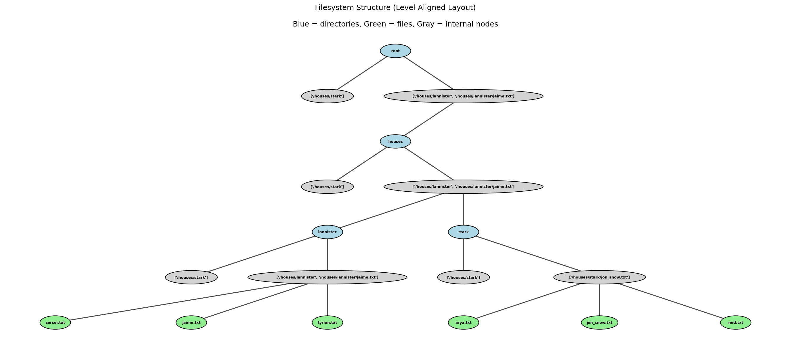

# bplus-tree-terminal

This repository is a simulation of a Unix Terminal using a B+ tree implemented in Python from scratch. It also contains benchmarks and performance graph analysis.

It was developed as the final project for the course Fundamentals of Information Structure (DAS5102) at the Federal University of Santa Catarina, for the Control and Automation Engineering Course.

All the project it is formatted using Python Black Formatter

For detailed information about the B+ Tree data structure, implementation, and development process, check out our [Development Documentation](DEVELOPMENT.md).

References and articles that guided the development of this project and provide a comprehensive understanding of B+ Trees:

1. https://medium.com/@akashsdas_dev/b-trees-and-b-trees-682d363df1f7
2. https://www.programiz.com/dsa/b-plus-tree
3. https://planetscale.com/blog/btrees-and-database-indexes
4. https://www.geeksforgeeks.org/dsa/b-tree-in-python-2/#operations-on-b-trees

# Setup

Create and activate a virtual environment, then install requirements:

```bash
python3 -m venv venv
source venv/bin/activate
pip install -r requirements.txt
```

# Project Structure

The project is organized into three main components:

- **B+ Tree Implementation**: Core data structure with operations
- **Analysis and Benchmarks**: Performance testing and complexity analysis
- **Terminal**: Interactive filesystem using the B+ tree

# B+ Tree

Check the `bplus_tree.py` file for the complete implementation. You can run the following tests in order to understand the functionality:

```bash
python3 -m tests.demo_tree
python3 -m tests.insertion_tests
python3 -m tests.delete_tests
python3 -m tests.utilities_tests
python3 -m tests.basic_tests
```

# Analysis and Benchmarks

Run the complexity analysis:

```bash
python3 -m analysis.run_complexity_analysis
```

The `complexity_analysis.py` performs benchmarks on all B+ tree operations (insert, search, delete, range query) across different data sizes. It measures execution times and compares them with theoretical complexity expectations. The analysis results are documented in `analysis/COMPLEXITY_ANALYSIS.md`.


# Terminal

The terminal simulation is implemented through two main files:

- **`shell.py`**: Interactive terminal interface using Textual library that provides a Unix-like command prompt
- **`commands.py`**: Virtual filesystem implementation that wraps the B+ tree to handle file and directory operations

Run the interactive terminal:

```bash
python3 shell.py
```

## How to Use the Terminal

The terminal supports the following commands:

### `mkdir <directory_name>`

Create a new directory in the current location.

```bash
fakerational:/$ mkdir projects
Directory 'projects' created
fakerational:/$ mkdir documents
Directory 'documents' created
```

### `ls [path]`

List contents of current directory or specified path.

```bash
fakerational:/$ ls
documents/ projects/
fakerational:/$ ls projects
[empty]
```

### `cd <path>`

Change to specified directory. Use `..` to go up one level or `/` for root.

```bash
fakerational:/$ cd projects
fakerational:/projects$ cd ..
fakerational:/$ cd /
fakerational:/$
```

### `touch <filename>`

Create a new file in the current directory.

```bash
fakerational:/projects$ touch main.py
File 'main.py' created
fakerational:/projects$ touch README.md
File 'README.md' created
fakerational:/projects$ ls
main.py README.md
```

### `rm <name>`

Remove a file or directory.

```bash
fakerational:/projects$ rm main.py
'main.py' removed
fakerational:/projects$ ls
README.md
```

### `exit`

Exit the terminal application.

```bash
fakerational:/$ exit
```

## Filesystem Visualization

The `filesystem_visualization/` folder contains tools to visualize the filesystem structure as a tree. The visualization shows the logical directory hierarchy with directories in blue and files in green.

```bash
python3 -m filesystem_visualization.filesystem_visualization
```

This creates a sample Game of Thrones themed filesystem and generates a tree visualization:


